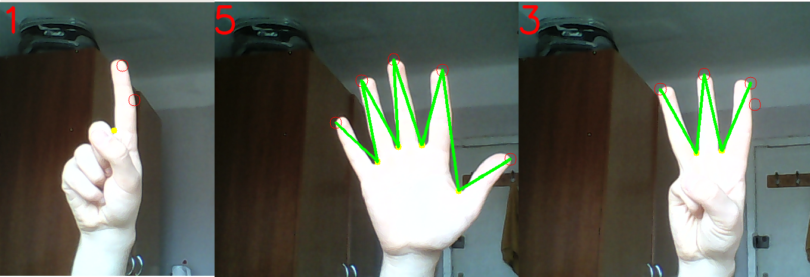

# Count-fingers
Project with opencv for count number of fingers from webcam.

## Instructions
Before run the program ensure that you have a good lighting on hand

```shell
mkdir count-fingers
cd count fingers
git clone https://github.com/vanhry/Count-fingers-opencv
python -m venv venv
source venv/bin/activate
pip install -r requirements.txt
python finger_detect_video.py
```

## Results


## Useful links for me

* [gist.github.com/endolith](https://gist.github.com/endolith/250860)
* [opencv tutorial](https://docs.opencv.org/3.0-beta/doc/py_tutorials/py_tutorials.html)
* (http://sa-cybernetics.github.io/blog/2013/08/12/hand-tracking-and-recognition-with-opencv "sa-cybernetics.github.io/blog/2013/08/12/hand-tracking-and-recognition-with-opencv)
